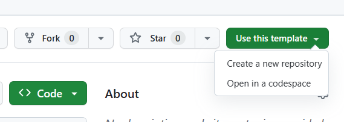
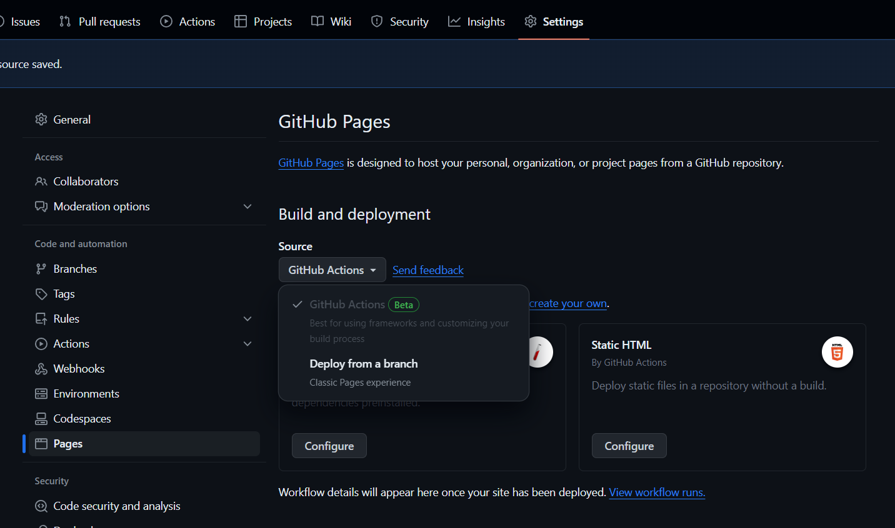

# Project Overview
Our aim for this project was to create an interactive map visualization displaying the internet usage percentages by country across specifiable years. We wanted the map itself to statically convey an overview of the internet usage variance along with an additional insight interaction from hovering over specific countries. In developing this interactive visualization, we made a series of deliberate design decisions to ensure a compelling user experience and effective data communication. First and foremost, we opted to represent the world map using D3.js with a natural earth projection. This choice aimed to provide users with a familiar and intuitive visualization of global geography, facilitating their understanding of internet usage distribution across different countries.

For encoding internet usage percentages, we employed a sequential color scale ranging from blue to white. Blue, often associated with technology and communication, was chosen to signify higher internet usage percentages, while white conveys neutrality and clarity. This color scheme enables users to quickly grasp variations in internet usage across regions. In terms of interaction, we implemented mouseover events to trigger tooltips displaying detailed information about each country's internet usage percentage. This interactive feature enhances user engagement and facilitates exploration of specific data points, fostering a deeper understanding of the dataset. To enable temporal analysis, we provided buttons for users to select different years, dynamically updating the visualization accordingly. This functionality allows users to observe changes in internet usage over time, enhancing the utility of the application for analytical purposes. Throughout the development process, we focused on creating a seamless user experience by carefully styling the components using CSS. Attention was given to typography, color schemes, and layout design to ensure a visually appealing interface that encourages user interaction.

On the map side, Adalina took charge of the hovering features, mapping the dataset to the map, and making sure the buttons matched the right dataset. I would estimate that the development time took about 15 to 20 hours spread over 5 days. Among the many facets, fundamental chores like configuring the SVG container and projecting the map called for close attention to detail and a working knowledge of D3.js features. Adalina's concentration on this field was essential to guaranteeing the global map's correct depiction and the dataset's smooth integration.

Implementing tooltip functionality and interaction handling required meticulous coding to ensure smooth user experience and intuitive interaction with the visualization. Adalina's focus on these aspects ensured that users could easily access additional information about each country and receive visual feedback upon interaction. Adalina also dealt with responsive design across different screen sizes which demanded additional effort to dynamically adjust the SVG container and map projection. Throughout the development process, iterative refinement and incorporation of user feedback were essential to fine-tune the visualization's design and functionality. 

Through the development of our interactive map, Mark’s contributions focused on increasing the interpretability and functionality of the site, as well as assisting with general aesthetic improvements of the site. A primary role was taken in data cleaning and filtering, ensuring that our dataset containing internet usage % by country was organized in a way that was easy to incorporate into our map. This included querying data by year to separate our dataset into 7 different .csv files and manually removing/altering irrelevant data that were initially included in the dataset.

Mark also contributed to developing the style of the buttons with a focus on keeping them simple yet visually appealing and fitting with the color scheme of the map data. The buttons serve as one of the main key features of interactivity in this project, and by incorporating elements like shadows and hovering, user experience can improve with the well-integrated designs. Additionally, Mark created an intuitive gradient legend in the bottom left to assist readers with interpretation of our data. This not only leads to improved user engagement with the data but also allows the user to observe and predict trends in internet usage data themselves.
	
Eric primarily took up a supporting role in each area of the project, helping Adalina and Mark with design decisions on the direction we wanted to take our visualization while concurrently building the initial program. He ensured visual continuity and clarity, making sure that the map was easy to read through deliberation color and stroke selection. Moreover, he helped build out the year changing system, giving the user a clear picture of the selections. He also worked with Mark, creating the data mapping between countries, such that the internet usage data was correctly aligned to the countries used for the map.

In summary, our development process involved meticulous decision-making to create an interactive web application that effectively communicates global internet usage trends and distributions.


# svelte-template

This repo contains a template for a Svelte project that uses D3. It has extra
configuration to make it easy to deploy to GitHub pages.

## Getting started

Click the green "Use this template" button, then "Create a new repository" in
the top right portion of the webpage.



After GitHub completes the cloning process, navigate to the Settings page. On
the left panel, under the "Pages" tab, locate the "Source" section and select
"GitHub Actions" as the source.

Then, clone this repository to your local computer. After cloning the
repository, navigate to the repository in your terminal and run:

```
npm install
```

To start your local dev server, run

```
npm run dev
```

You can now edit your files in VSCode to see changes update in your browser.
Start by making a small edit to `src/components/App.svelte` and make sure that
the changes are reflected in your browser window.

### Including static files (e.g. datasets)

To include files like datasets and images in your project, place your files in
the `static/` folder (NOT the `src/` folder).

For example, if you have a file `static/temp.csv`, your code can load that
file by using a relative path:

```js
const res = await fetch('temp.csv');
```

Note that with our default configuration, all of these snippets **might work
locally but not on GitHub pages**:

```js
// None of these work properly
// const res = await fetch('/temp.csv');
// const res = await fetch('static/temp.csv');
```

### Using other packages (e.g. Mapbox)

To include other packages in your project, install them first by running:

```js
npm install --save moment
```

Then, you can import the packages in your Svelte JS like so:

```js
import moment from 'moment';
```

You should double check the package page to make sure you didn't miss anything
during import. For example, the web page for setting up mapbox-gl with Svelte
(https://docs.mapbox.com/help/tutorials/use-mapbox-gl-js-with-svelte/) says
that you should actually write two `import` statements:

```js
// This imports the package itself
import mapbox from 'mapbox-gl';
// This import the mapbox CSS styles
import 'mapbox-gl/dist/mapbox-gl.css';
```

## Deploying your webpage

To update your GitHub page, make a commit locally and push your changes to
GitHub. When you do so, the corresponding GitHub Actions will execute and
automatically update your static website hosted at
`https://your-username.github.io/your-repo-name` for you.



## Debugging

**My code works locally but when I push to GitHub the deployment fails.**

Run `npm run build`, which tries to replicate GitHub's build process. Ideally,
that command will give the same error message as the GitHub workflow. If so,
you can tinker with your code locally until `npm run build` works, which will
have a very high chance of fixing your build. If the command doesn't give the
same result as the GitHub workflow, make an Ed post.

**My code works locally and deploys, but nothing renders on the screen.**

Check to make sure that your static files (e.g. datasets) are loaded properly.
For example, if you have a file `static/temp.csv`, your code should load that
file by using a relative path.

If that doesn't fix your bug, open your browser's console window and see if an
error appears.
